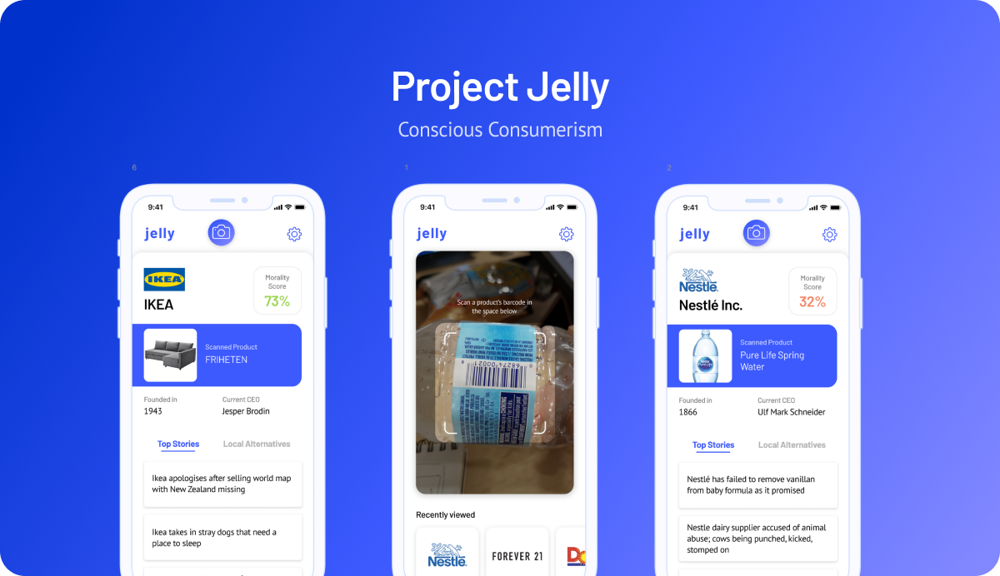

# RU Hacks 2019

### [Check this out on HackerEarth](https://ruhacks2019.hackerearth.com/challenges/hackathon/ru-hacks-2019/dashboard/254afaf/submission/)

Our product creates awareness of unethically sourced products. And sheds a light on locally sourced alternatives. We hope to play a part in protecting basic human rights, while giving local economies an opportunity to grow in a crowded marketplace.

We built an application that, when a product's barcode code is scanned, will display information about the product's company to see whether the company is ethical and adheres to positive business practices.

